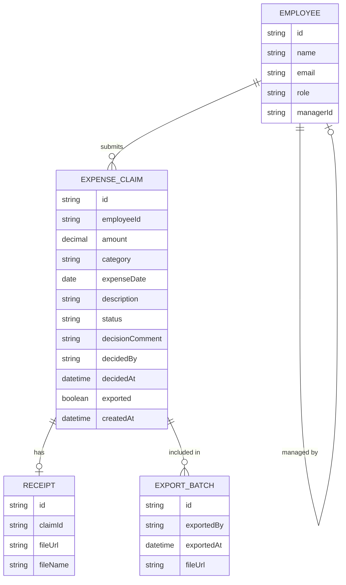

# Domain Model

The core entities behind expense claim submission, approval, and payroll
export.

- **EMPLOYEE** — every signed-in user (employee, manager, finance, admin);
`role` distinguishes the actor, `managerId` links an employee to their
fixed approving manager.
- **EXPENSE\_CLAIM** — one reimbursement request; `status` is one of
`pending`, `approved`, `rejected`; `exported` flags whether it has been
included in a payroll export.
- **RECEIPT** — the optional attached file for a claim, stored via `aws-s3`.
- **EXPORT\_BATCH** — one payroll export run finance produced, recording which
file was generated and when.

