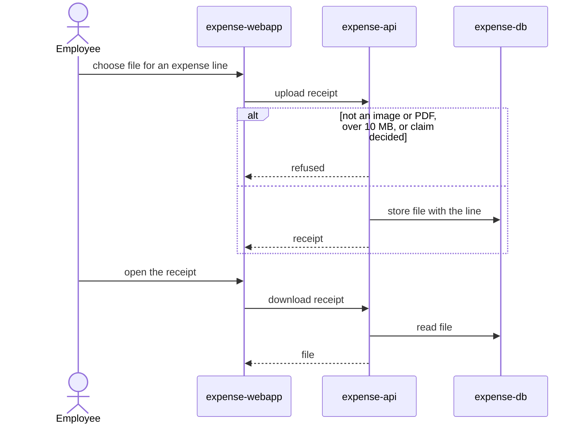

# Attach a receipt

An employee attaches a receipt to an expense line; the API checks and stores the file in its database.

```mermaid
sequenceDiagram
    actor Employee
    participant expense-webapp
    participant expense-api
    participant expense-db

    Employee->>expense-webapp: choose file for an expense line
    expense-webapp->>expense-api: upload receipt
    alt not an image or PDF, over 10 MB, or claim decided
        expense-api-->>expense-webapp: refused
    else
        expense-api->>expense-db: store file with the line
        expense-api-->>expense-webapp: receipt
    end
    Employee->>expense-webapp: open the receipt
    expense-webapp->>expense-api: download receipt
    expense-api->>expense-db: read file
    expense-api-->>expense-webapp: file
```