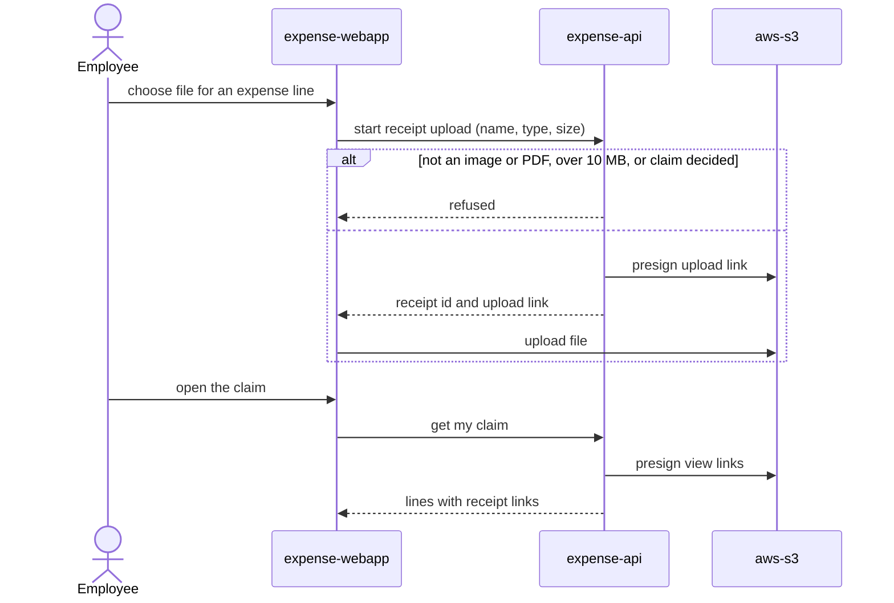

# Attach a receipt

An employee attaches a receipt to an expense line; the file goes straight to storage and never passes through the API.

```mermaid
sequenceDiagram
    actor Employee
    participant expense-webapp
    participant expense-api
    participant aws-s3

    Employee->>expense-webapp: choose file for an expense line
    expense-webapp->>expense-api: start receipt upload (name, type, size)
    alt not an image or PDF, over 10 MB, or claim decided
        expense-api-->>expense-webapp: refused
    else
        expense-api->>aws-s3: presign upload link
        expense-api-->>expense-webapp: receipt id and upload link
        expense-webapp->>aws-s3: upload file
    end
    Employee->>expense-webapp: open the claim
    expense-webapp->>expense-api: get my claim
    expense-api->>aws-s3: presign view links
    expense-api-->>expense-webapp: lines with receipt links
```