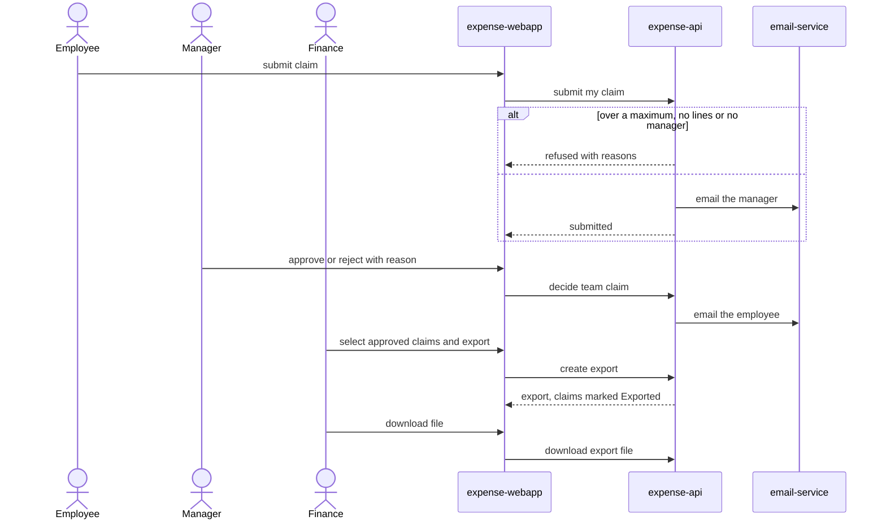

# Claim to payroll

An employee submits a claim, their manager approves it, and Finance exports it to payroll. Emails go out at each decision.

```mermaid
sequenceDiagram
    actor Employee
    actor Manager
    actor Finance
    participant expense-webapp
    participant expense-api
    participant email-service

    Employee->>expense-webapp: submit claim
    expense-webapp->>expense-api: submit my claim
    alt over a maximum, no lines or no manager
        expense-api-->>expense-webapp: refused with reasons
    else
        expense-api->>email-service: email the manager
        expense-api-->>expense-webapp: submitted
    end
    Manager->>expense-webapp: approve or reject with reason
    expense-webapp->>expense-api: decide team claim
    expense-api->>email-service: email the employee
    Finance->>expense-webapp: select approved claims and export
    expense-webapp->>expense-api: create export
    expense-api-->>expense-webapp: export, claims marked Exported
    Finance->>expense-webapp: download file
    expense-webapp->>expense-api: download export file
```