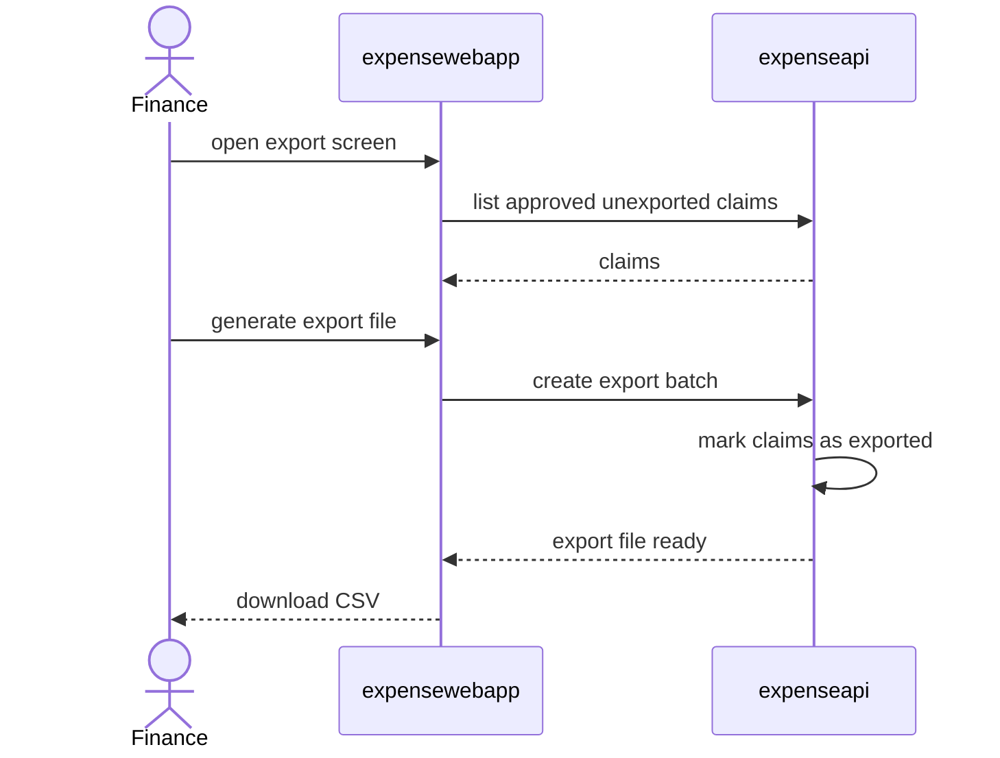

# Export Approved Claims to Payroll

Finance reviews approved, un-exported claims and downloads them as a file for
payroll, which marks those claims as exported.

```mermaid
sequenceDiagram
    actor Finance
    participant expensewebapp
    participant expenseapi

    Finance->>expensewebapp: open export screen
    expensewebapp->>expenseapi: list approved unexported claims
    expenseapi-->>expensewebapp: claims

    Finance->>expensewebapp: generate export file
    expensewebapp->>expenseapi: create export batch
    expenseapi->>expenseapi: mark claims as exported
    expenseapi-->>expensewebapp: export file ready
    expensewebapp-->>Finance: download CSV
```

