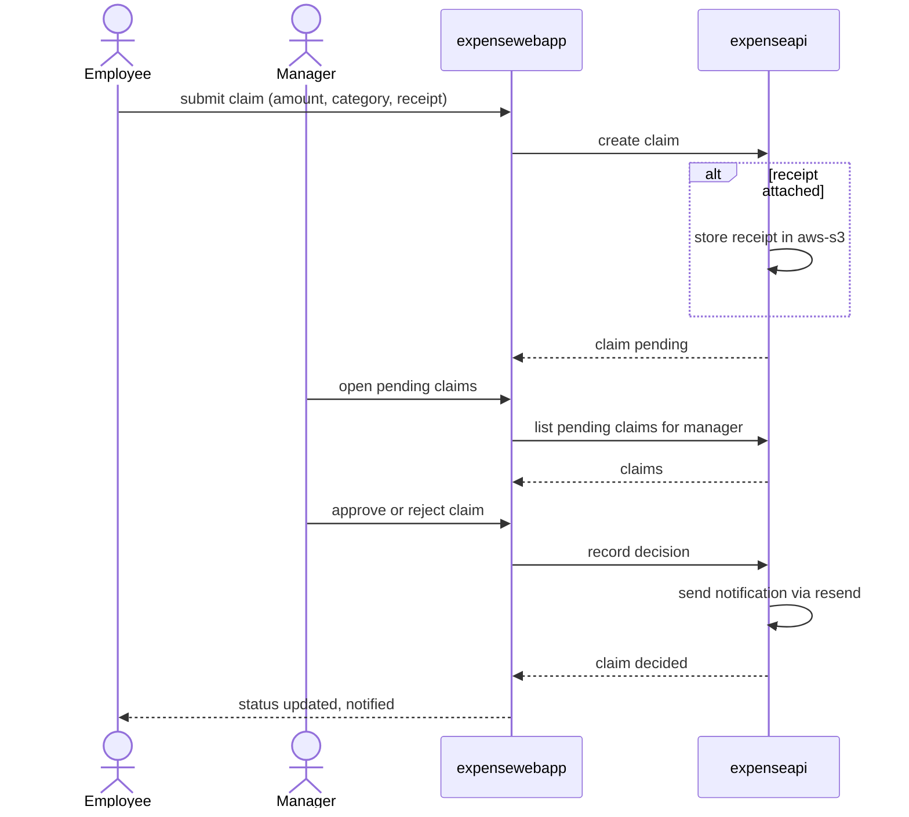

# Submit and Approve an Expense Claim

An employee submits a claim with an optional receipt; their manager reviews
it and approves or rejects it, and the employee is notified of the outcome.

```mermaid
sequenceDiagram
    actor Employee
    actor Manager
    participant expensewebapp
    participant expenseapi

    Employee->>expensewebapp: submit claim (amount, category, receipt)
    expensewebapp->>expenseapi: create claim
    alt receipt attached
        expenseapi->>expenseapi: store receipt in aws-s3
    end
    expenseapi-->>expensewebapp: claim pending

    Manager->>expensewebapp: open pending claims
    expensewebapp->>expenseapi: list pending claims for manager
    expenseapi-->>expensewebapp: claims

    Manager->>expensewebapp: approve or reject claim
    expensewebapp->>expenseapi: record decision
    expenseapi->>expenseapi: send notification via resend
    expenseapi-->>expensewebapp: claim decided
    expensewebapp-->>Employee: status updated, notified
```

